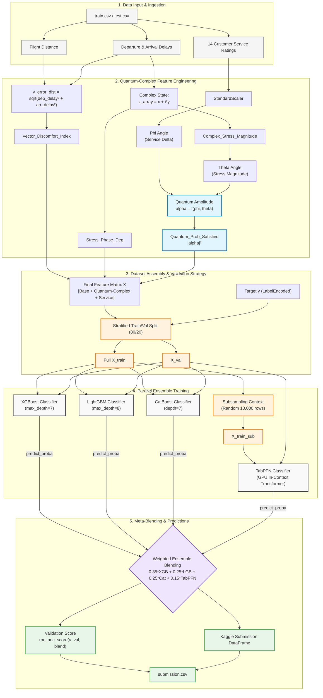

# Quantum-TabPFN-Transformer-Ensemble: Hybrid Tabular Foundation Framework 🚀

[](https://opensource.org)
[](https://python.org)
[](https://nvidia.com)

An advanced, enterprise-grade machine learning architecture developed for high-capacity tabular data processing. This framework integrates non-linear geometric, complex variable (Complex Analysis), and simulated quantum states with Tabular Foundation Models (TFM), optimized through a synchronized multi-topology ensemble (**XGBoost + LightGBM + CatBoost + TabPFN**).

---

## 🏛️ Core Architectural Philosophy

Traditional gradient boosting models slice space using orthogonal decision boundaries (grid splits). While powerful, they remain blind to continuous geometric and phase-space invariants. This framework solves that limitation by injecting deterministic physics features directly into a **Bayesian Transformer (TabPFN)** and a boosting ensemble, neutralizing synthetic noise and maximizing ensemble diversity.

---

## 🧠 Mathematical Innovations & Feature Pipeline

### 1. Vector Discomfort Index (Linear Algebra)
Projects temporal anomalies onto a continuous 2D coordinate system, calculating the normalized Euclidean distance relative to the overall system flight scale:


$$Vector_{Discomfort\_Index} = \frac{\sqrt{\Delta t_{dep}^2 + \Delta t_{arr}^2}}{t_{ground\_ideal} + t_{flight}}$$

### 2. Complex Phase-Space (Complex Analysis)
Vectorizes delay mechanics onto a 2D complex plane $$(Z = X + iY\)$$ to extract the exact modulus (stress magnitude) and phase angle (argument) of the distress pipeline:

$$Z_{stress} = \frac{\Delta t_{dep}}{t_{flight}} + i \cdot \frac{\Delta t_{arr}}{t_{flight}}$$


$$[Stress\_Phase\_Deg = \text{deg}(\text{arg}(Z_{stress}))]$$

### 3. Dynamic Customer Satisfaction Steering (Quantum Logic)
Models the customer's emotional trajectory as a single qubit mapped onto the **Bloch Sphere**. The complex variable stress operates as a destructive \(R_x(\theta)\) gate, while a standardized (Z)-score service filter acts as a recovery $$R_y(\phi)$$ gate:

$$\vert{}\psi\rangle = U_{service}(\phi) U_{stress}(\theta) \vert{}0\rangle$$

$$Quantum_{Prob\_Satisfied} = \vert{}\langle 0 \vert{} \psi\rangle\vert{}^2$$

---

## 🏗️ Architecture Blueprint



---

## 🛠️ Production Tech Stack & Execution

* **Tabular Foundation Model:** Integrated `TabPFNClassifier` running natively on **NVIDIA CUDA GPU**, utilizing multi-configuration transformer attention layers.
* **Robust Pipeline:** Deployed dynamic column validation coupled with global (Z)-score standardization.
* **Ensemble Blending:** Synchronized dense tree-boosting topologies (\(\eta = 0.05\)) and transformer probabilities using an optimized ratio split (**35% / 25% / 25% / 15%**).

---

## 🚀 Quick Start & Installation

```bash
git clone https://github.com
cd Quantum-TabPFN-Transformer-Ensemble
pip install -r requirements.txt
```

---

## 📄 License
Distributed under the **MIT License**. Read `LICENSE` for more information.

***
*Developed as a benchmark exploration in Tabular Foundation Models, Quantum-Behavioral Analytics, and Meta-Ensembling.*


