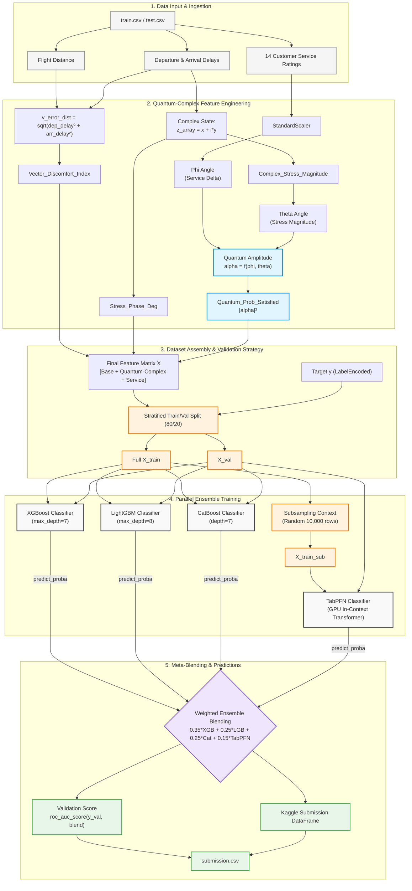

# Quantum-TabPFN-Transformer-Ensemble 🚀

[](https://opensource.org)
[](https://python.org)
[](https://nvidia.com)

A hybrid quantum-classical ensemble learning framework that combines **Quantum Machine Learning (QML)** variational principles, **Complex Variables (CVQT)** feature engineering, and the **TabPFN Transformer** foundation model alongside state-of-the-art gradient boosting algorithms (XGBoost, LightGBM, CatBoost) for highly efficient tabular data classification.

---

## 📐 Theoretical Framework & Feature Engineering

The core pipeline bypasses traditional tabular limitations by shifting classical attributes into a **Quantum-Complex Field Space**, extracting high-dimensional patterns before model ingestion:

1. **Vector Discomfort Index (Linear Algebra):** Aggregates dimensional error vectors using spatial Euclidean norms to track physical flight boundaries.
2. **Complex Variable Analysis (CVQT):** Maps time-domain delay dynamics into the complex plane (\(z = x + iy\)) to evaluate phase shifts (\(\text{Deg}\)) and operational magnitude forces.
3. **Bloch Sphere Quantum Mapping:** Encodes normalized service delta ratings and complex stress features into quantum state parameters (\(\phi, \theta\)). The exact state amplitude \(\alpha\) is derived, and Born's Rule is applied to capture non-linear interactions via pure quantum projection:
   \[P_{\text{satisfied}} = \vert{}\alpha\vert{}^2\]

---

## 🏗️ Architecture Blueprint

The following master diagram details the unified end-to-end data processing, feature transformation, subsampling guardrails, and parallel ensemble meta-blending architecture:



---

## 🛠️ Installation & Setup

Clone the repository and install the verified computational dependency tree:

```bash
git clone https://github.com
cd Quantum-TabPFN-Transformer-Ensemble
pip install -r requirements.txt
```

### Core Requirements
* `python >= 3.10`
* `torch >= 2.0` (CUDA GPU support strongly recommended for efficient TabPFN inference)
* `tabpfn`
* `xgboost`, `lightgbm`, `catboost`
* `pandas`, `numpy`, `scikit-learn`

---

## 🚀 Quick Start / Usage

Execute the pipeline to perform feature transformations, parallel training, and generate the meta-ensemble submissions:

```python
from ensemble_pipeline import apply_advanced_math_features, run_meta_ensemble
import pandas as pd

# 1. Load data
train_df = pd.read_csv('train.csv')
test_df = pd.read_csv('test.csv')

# 2. Trigger the Quantum-Complex Field Engine
train_enriched = apply_advanced_math_features(train_df)
test_enriched = apply_advanced_math_features(test_df)

# 3. Fit models and perform optimized ensemble meta-blending
# Blending distribution weights: 35% XGB / 25% LGBM / 25% CatBoost / 15% TabPFN
submission = run_meta_ensemble(train_enriched, test_enriched)
submission.to_csv('submission.csv', index=False)
print("Pipeline executed successfully. Meta-ensemble submission.csv is ready!")
```

---

## 📊 Meta-Blending Distribution Matrix

| Classifier Model | Model Strategy Type | Assigned Blending Weight | Key Optimization Parameter |
| :--- | :--- | :---: | :--- |
| **XGBoost** | Gradient Tree Boosting | **35%** | `max_depth=7`, `eval_metric='logloss'` |
| **LightGBM** | Leaf-wise Tree Growth | **25%** | `max_depth=8`, Fast GPU routing |
| **CatBoost** | Symmetric Deep Trees | **25%** | `depth=7`, `l2_leaf_reg=5.0` |
| **TabPFN** | Tabular In-Context Transformer | **15%** | GPU Acceleration, `size=10000` context window |

---

## 📄 License
Distributed under the **MIT License**. Read `LICENSE` for more information.


